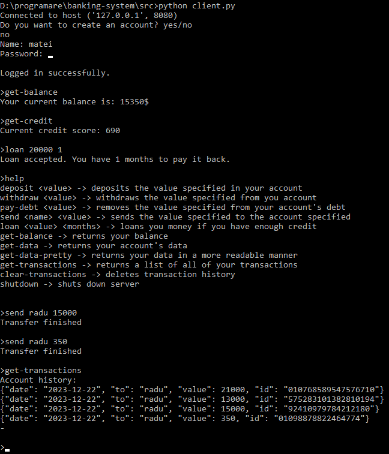

# Banking System

### [MongoDB documentation page](https://www.mongodb.com/docs/)
## Description
This project is an attempt at recreating banks' monetization and transaction systems. Using *mongoDB* in *python*, the user can easily connect to the server and start making some transactions between accounts and more.

## How to use
First of all, make sure you have all the required libraries installed by running `pip install requirements.txt` in your command line.
After the installation is over, you can go ahead and run *server.py* (either by running *run-server.bat* or typing `python server.py` in your command line). Do the same thing in order to run *client.py*. Now, you can type *help* in your client side to start using commands.

## Used Dependencies
- PyMongo -> Used for creating an easy accessed class that maintains the local MongoDB database;
- Sockets -> For communicating over the internet with different computers;
- Threading -> To create threads of *clients* that run simultaneously, as well to create mutex locks that block people from using the same function at once (when more than 2 connections running that function can result in errors. [Read more](https://stackoverflow.com/questions/34524/what-is-a-mutex));
- Getpass -> To type hidden passwords;
- Hashlib -> To generate hashes for transaction ids, as well as to hash pins/passwords to send to the server.

## Features
1. Due to MongoDB's speed and scalability, the program offers fast and accurate responses;
2. Easy to use. Although the program is ran in the terminal, it's really easy to use due to all the information that's listed below;
3. Capable of holding lots of people connected to the server at once, without any errors/glitches occuring;
## Examples

## Help
Feel free to ask any questions, either on *github* or on my [moraru.matei24@gmail.com](mailto:moraru.matei24@gmail.com).