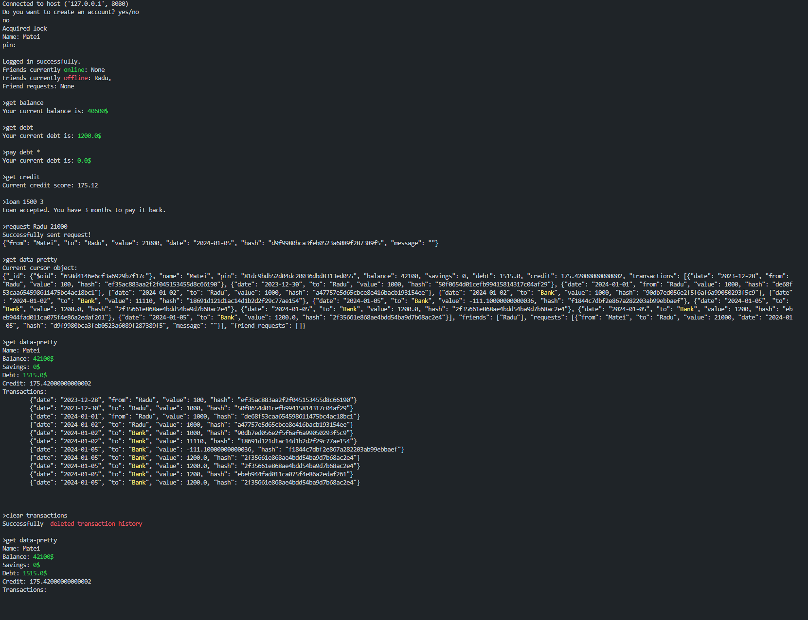

# Banking System

### [MongoDB documentation page](https://www.mongodb.com/docs/)

## Project Overview

This project aims to replicate banking monetization and transaction systems. Leveraging *mongoDB* with *Python*, users can effortlessly connect to the server and initiate transactions between accounts and more.

## How to Use

1. Ensure all required libraries are installed by executing `pip install -r requirements.txt` in your command line.
2. Run the server using either *run-server.bat* or by typing `python server.py` in your command line.
3. Repeat the process to run *client.py*. Type *help* on the *client* side to explore available commands.

## Dependencies

- **PyMongo(v4.6.0):** Facilitates an easily accessible class maintaining the local MongoDB database.
- **Socket:** Enables communication over the internet with different computers.
- **Threading:** Creates threads for simultaneous *clients* and mutex locks to prevent concurrent function usage (more than two connections running the same function may result in errors. [Learn more](https://stackoverflow.com/questions/34524/what-is-a-mutex)).
- **Getpass:** Allows input of hidden passwords.
- **Hashlib:** Generates hashes for transaction IDs and hashes pins/passwords sent to the server.
- **Colorama(v0.4.6):** Adds color to the *client* UI.
- **Bson(v0.5.10):** Converts JSONs into strings.

## Key Features

1. **MongoDB Speed and Scalability:** The program ensures fast responses owing to MongoDB's efficiency.
2. **User-Friendly Command Line Interface:** Although lacking a GUI, the program is easy to use, aided by the *help* command listing all possible commands.
3. **Thread Management:** Threads are pivotal for the server to handle multiple users concurrently. *Threading* creates a thread for each connection and manages mutexes.

## Examples

## Support and Contact

Feel free to reach out with any questions or concerns on *GitHub* or via email at [moraru.matei24@gmail.com](mailto:moraru.matei24@gmail.com).
